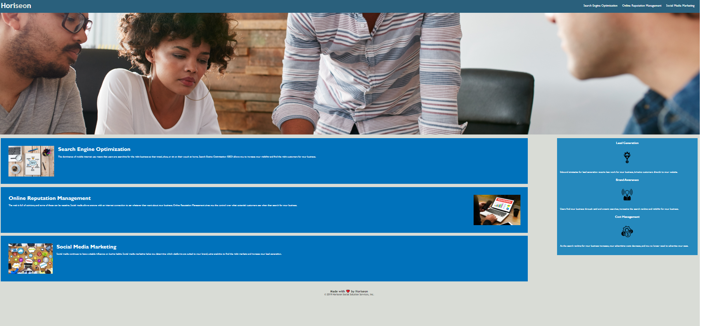

# Code Refactor Starter Code

This project required refactoring code for the "Horiseon" website.

Changes made:
-Alt text added to appropriate images
-Added comments to the html and css to make reading the code easier
-Fixed a link to Search Engine Optimization in the Nav bar
-combined many of the syle elements in the css to cut down on repeated code
-rearranged stlye selectors under appropriate comments to make it easier to read

Link to deployed website: https://adamkeyser45.github.io/mod1challenge/
